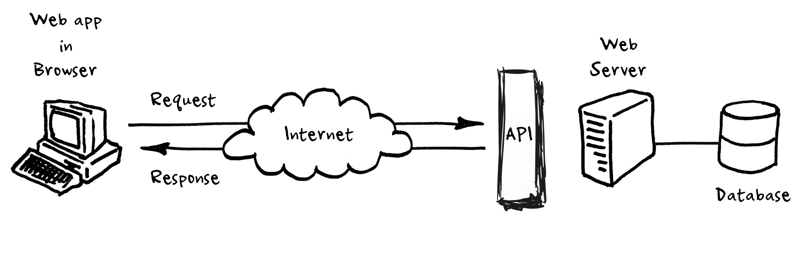
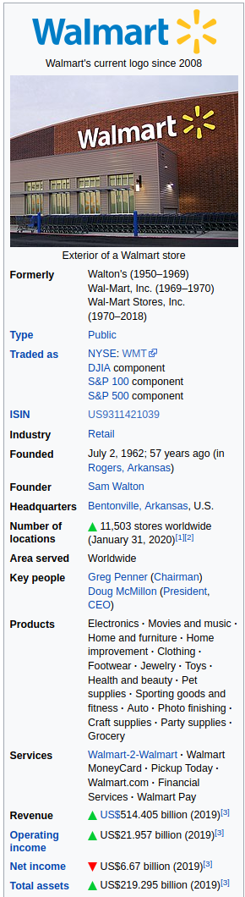

[](https://colab.research.google.com/github/MonashDataFluency/python-web-scraping/blob/master/notebooks/section-3-API-based-scraping.ipynb)



### A brief introduction to APIs
---

In this section, we will take a look at an alternative way to gather data than the previous pattern based HTML scraping. Sometimes websites offer an API (or Application Programming Interface) as a service which provides a high level interface to directly retrieve data from their repositories or databases at the backend. 

From Wikipedia,

> "*An API is typically defined as a set of specifications, such as Hypertext Transfer Protocol (HTTP) request messages, along with a definition of the structure of response messages, usually in an Extensible Markup Language (XML) or JavaScript Object Notation (JSON) format.*"

They typically tend to be URL endpoints (to be fired as requests) that need to be modified based on our requirements (what we desire in the response body) which then returns some a payload (data) within the response, formatted as either JSON, XML or HTML. 

A popular web architecture style called `REST` (or representational state transfer) allows users to interact with web services via `GET` and `POST` calls (two most commonly used) which we briefly saw in the previous section.

For example, Twitter's REST API allows developers to access core Twitter data and the Search API provides methods for developers to interact with Twitter Search and trends data.

There are primarily two ways to use APIs :

- Through the command terminal using URL endpoints, or
- Through programming language specific *wrappers*

For example, `Tweepy` is a famous python wrapper for Twitter API whereas `twurl` is a command line interface (CLI) tool but both can achieve the same outcomes.

Here we focus on the latter approach and will use a Python library (a wrapper) called `wptools` based around the original MediaWiki API.

One advantage of using official APIs is that they are usually compliant of the terms of service (ToS) of a particular service that researchers are looking to gather data from. However, third-party libraries or packages which claim to provide more throughput than the official APIs (rate limits, number of requests/sec) generally operate in a gray area as they tend to violate ToS. Always be sure to read their documentation throughly.

### Wikipedia API
---

Let's say we want to gather some additional data about the Fortune 500 companies and since wikipedia is a rich source for data we decide to use the MediaWiki API to scrape this data. One very good place to start would be to look at the **infoboxes** (as wikipedia defines them) of articles corresponsing to each company on the list. They essentially contain a wealth of metadata about a particular entity the article belongs to which in our case is a company. 

For e.g. consider the wikipedia article for **Walmart** (https://en.wikipedia.org/wiki/Walmart) which includes the following infobox :



As we can see from above, the infoboxes could provide us with a lot of valuable information such as :

- Year of founding 
- Industry
- Founder(s)
- Products	
- Services	
- Operating income
- Net income
- Total assets
- Total equity
- Number of employees etc

Although we expect this data to be fairly organized, it would require some post-processing which we will tackle in our next section. We pick a subset of our data and focus only on the top **20** of the Fortune 500 from the full list. 

Let's begin by installing some of libraries we will use for this excercise as follows,


```python
# sudo apt install libcurl4-openssl-dev libssl-dev
!pip install wptools
!pip install wikipedia
!pip install wordcloud
```

    Requirement already satisfied: wptools in c:\users\apidwalin\anaconda3\envs\tensorflow1\lib\site-packages (0.4.17)
    Requirement already satisfied: html2text in c:\users\apidwalin\anaconda3\envs\tensorflow1\lib\site-packages (from wptools) (2020.1.16)
    Requirement already satisfied: pycurl in c:\users\apidwalin\anaconda3\envs\tensorflow1\lib\site-packages (from wptools) (7.43.0.5)
    Requirement already satisfied: lxml in c:\users\apidwalin\anaconda3\envs\tensorflow1\lib\site-packages (from wptools) (4.6.1)
    Requirement already satisfied: certifi in c:\users\apidwalin\anaconda3\envs\tensorflow1\lib\site-packages (from wptools) (2021.5.30)
    Requirement already satisfied: wikipedia in c:\users\apidwalin\anaconda3\envs\tensorflow1\lib\site-packages (1.4.0)
    Requirement already satisfied: requests<3.0.0,>=2.0.0 in c:\users\apidwalin\anaconda3\envs\tensorflow1\lib\site-packages (from wikipedia) (2.24.0)
    Requirement already satisfied: beautifulsoup4 in c:\users\apidwalin\anaconda3\envs\tensorflow1\lib\site-packages (from wikipedia) (4.8.2)
    Requirement already satisfied: idna<3,>=2.5 in c:\users\apidwalin\anaconda3\envs\tensorflow1\lib\site-packages (from requests<3.0.0,>=2.0.0->wikipedia) (2.10)
    Requirement already satisfied: urllib3!=1.25.0,!=1.25.1,<1.26,>=1.21.1 in c:\users\apidwalin\anaconda3\envs\tensorflow1\lib\site-packages (from requests<3.0.0,>=2.0.0->wikipedia) (1.25.11)
    Requirement already satisfied: certifi>=2017.4.17 in c:\users\apidwalin\anaconda3\envs\tensorflow1\lib\site-packages (from requests<3.0.0,>=2.0.0->wikipedia) (2021.5.30)
    Requirement already satisfied: chardet<4,>=3.0.2 in c:\users\apidwalin\anaconda3\envs\tensorflow1\lib\site-packages (from requests<3.0.0,>=2.0.0->wikipedia) (3.0.4)
    Requirement already satisfied: soupsieve>=1.2 in c:\users\apidwalin\anaconda3\envs\tensorflow1\lib\site-packages (from beautifulsoup4->wikipedia) (1.9.5)
    Requirement already satisfied: wordcloud in c:\users\apidwalin\anaconda3\envs\tensorflow1\lib\site-packages (1.6.0)
    Requirement already satisfied: numpy>=1.6.1 in c:\users\apidwalin\anaconda3\envs\tensorflow1\lib\site-packages (from wordcloud) (1.19.5)
    Requirement already satisfied: matplotlib in c:\users\apidwalin\anaconda3\envs\tensorflow1\lib\site-packages (from wordcloud) (3.4.2)
    Requirement already satisfied: pillow in c:\users\apidwalin\anaconda3\envs\tensorflow1\lib\site-packages (from wordcloud) (8.3.1)
    Requirement already satisfied: pyparsing>=2.2.1 in c:\users\apidwalin\anaconda3\envs\tensorflow1\lib\site-packages (from matplotlib->wordcloud) (2.4.7)
    Requirement already satisfied: kiwisolver>=1.0.1 in c:\users\apidwalin\anaconda3\envs\tensorflow1\lib\site-packages (from matplotlib->wordcloud) (1.3.1)
    Requirement already satisfied: cycler>=0.10 in c:\users\apidwalin\anaconda3\envs\tensorflow1\lib\site-packages (from matplotlib->wordcloud) (0.10.0)
    Requirement already satisfied: python-dateutil>=2.7 in c:\users\apidwalin\anaconda3\envs\tensorflow1\lib\site-packages (from matplotlib->wordcloud) (2.8.1)
    Requirement already satisfied: six in c:\users\apidwalin\anaconda3\envs\tensorflow1\lib\site-packages (from cycler>=0.10->matplotlib->wordcloud) (1.15.0)
    

Importing the same,


```python
import json
import wptools
import wikipedia
import pandas as pd

print('wptools version : {}'.format(wptools.__version__)) # checking the installed version
```

    wptools version : 0.4.17
    

Now let's load the data which we scrapped in the previous section as follows,


```python
# If you dont have the file, you can use the below code to fetch it:
import urllib.request
url = 'https://raw.githubusercontent.com/MonashDataFluency/python-web-scraping/master/data/fortune_500_companies.csv'
urllib.request.urlretrieve(url, 'fortune_500_companies.csv')
```

    The history saving thread hit an unexpected error (OperationalError('database is locked')).History will not be written to the database.
    


    ('fortune_500_companies.csv', <http.client.HTTPMessage at 0x23702db6bc8>)


```python
fname = 'fortune_500_companies.csv' # scrapped data from previous section
df = pd.read_csv(fname)             # reading the csv file as a pandas df
df.head()                           # displaying the first 5 rows
```


<div>
<style scoped>
    .dataframe tbody tr th:only-of-type {
        vertical-align: middle;
    }

    .dataframe tbody tr th {
        vertical-align: top;
    }

    .dataframe thead th {
        text-align: right;
    }
</style>
<table border="1" class="dataframe">
  <thead>
    <tr style="text-align: right;">
      <th></th>
      <th>rank</th>
      <th>company_name</th>
      <th>company_website</th>
    </tr>
  </thead>
  <tbody>
    <tr>
      <th>0</th>
      <td>1</td>
      <td>Walmart</td>
      <td>http://www.stock.walmart.com</td>
    </tr>
    <tr>
      <th>1</th>
      <td>2</td>
      <td>Exxon Mobil</td>
      <td>http://www.exxonmobil.com</td>
    </tr>
    <tr>
      <th>2</th>
      <td>3</td>
      <td>Berkshire Hathaway</td>
      <td>http://www.berkshirehathaway.com</td>
    </tr>
    <tr>
      <th>3</th>
      <td>4</td>
      <td>Apple</td>
      <td>http://www.apple.com</td>
    </tr>
    <tr>
      <th>4</th>
      <td>5</td>
      <td>UnitedHealth Group</td>
      <td>http://www.unitedhealthgroup.com</td>
    </tr>
  </tbody>
</table>
</div>


|    |   rank | company_name       | company_website                  |
|---:|-------:|:-------------------|:---------------------------------|
|  0 |      1 | Walmart            | http://www.stock.walmart.com     |
|  1 |      2 | Exxon Mobil        | http://www.exxonmobil.com        |
|  2 |      3 | Berkshire Hathaway | http://www.berkshirehathaway.com |
|  3 |      4 | Apple              | http://www.apple.com             |
|  4 |      5 | UnitedHealth Group | http://www.unitedhealthgroup.com |


Let's focus and select only the top 20 companies from the list as follows,


```python
no_of_companies = 20                         # no of companies we are interested 
df_sub = df.iloc[:no_of_companies, :].copy() # only selecting the top 20 companies
companies = df_sub['company_name'].tolist()  # converting the column to a list
```

Taking a brief look at the same,


```python
for i, j in enumerate(companies):   # looping through the list of 20 company 
    print('{}. {}'.format(i+1, j))  # printing out the same
```

    1. Walmart
    2. Exxon Mobil
    3. Berkshire Hathaway
    4. Apple
    5. UnitedHealth Group
    6. McKesson
    7. CVS Health
    8. Amazon.com
    9. AT&T
    10. General Motors
    11. Ford Motor
    12. AmerisourceBergen
    13. Chevron
    14. Cardinal Health
    15. Costco
    16. Verizon
    17. Kroger
    18. General Electric
    19. Walgreens Boots Alliance
    20. JPMorgan Chase
    

### Getting article names from wiki

Right off the bat, as you might have guessed, one issue with matching the top 20 Fortune 500 companies to their wikipedia article names is that both of them would not be exactly the same i.e. they match character for character. There will be slight variation in their names.

To overcome this problem and ensure that we have all the company names and its corresponding wikipedia article, we will use the `wikipedia` package to get suggestions for the company names and their equivalent in wikipedia.


```python
wiki_search = [{company : wikipedia.search(company)} for company in companies]
```

Inspecting the same,


```python
for idx, company in enumerate(wiki_search):
    for i, j in company.items():
        print('{}. {} :\n{}'.format(idx+1, i ,', '.join(j)))
        print('\n')
```

    1. Walmart :
    Walmart, Criticism of Walmart, History of Walmart, Walmart (disambiguation), Asda, List of Walmart brands, Walmart Canada, Walmarting, People of Walmart, Doug McMillon
    
    
    2. Exxon Mobil :
    ExxonMobil, Exxon, ExxonMobil climate change controversy, Mobil, Exxon Valdez oil spill, ExxonMobil Australia, ExxonMobil Building, Accusations of ExxonMobil human rights violations in Indonesia, Rex Tillerson, Mobil 1
    
    
    3. Berkshire Hathaway :
    Berkshire Hathaway, List of assets owned by Berkshire Hathaway, Berkshire Hathaway Energy, Warren Buffett, List of Berkshire Hathaway publications, Berkshire Hathaway Assurance, Berkshire Hathaway GUARD Insurance Companies, The World's Billionaires, David L. Sokol, Brooks Sports
    
    
    4. Apple :
    Apple, Apple Inc., Apple (disambiguation), IPhone, IOS, A for Apple, MacOS, Apple silicon, Apples to Apples, Apple TV
    
    
    5. UnitedHealth Group :
    UnitedHealth Group, Optum, Pharmacy benefit management, Andrew Witty, Stephen J. Hemsley, Dow Jones Industrial Average, List of largest companies by revenue, William W. McGuire, PacifiCare Health Systems, Health Net
    
    
    6. McKesson :
    McKesson Corporation, McKesson Europe, DeRay Mckesson, McKesson & Robbins scandal (1938), McKesson (disambiguation), Rexall (Canada), LloydsPharmacy, List of largest companies by revenue, Phillip Musica, McKesson Plaza
    
    
    7. CVS Health :
    CVS Health, CVS Pharmacy, CVS Caremark, Pharmacy benefit management, CVS, CVS Health Charity Classic, Health Net, Larry Merlo, UnitedHealth Group, America First Policies
    
    
    8. Amazon.com :
    Amazon (company), Amazon Prime Video, History of Amazon, Criticism of Amazon, List of Amazon products and services, Amazon Appstore, Amazon.ae, Amazon S3, List of mergers and acquisitions by Amazon, List of Amazon locations
    
    
    9. AT&T :
    AT&T, T, AT&T Mobility, AT&T Corporation, AT&T U-verse, T-Pain, T.A.T.u., Ford Model T, T-Series (company), T. and T.
    
    
    10. General Motors :
    General Motors, History of General Motors, General Motors India, General Motors Vortec engine, General Motors Chapter 11 reorganization, List of General Motors factories, General Motors Firebird, Vauxhall Motors, GMC (automobile), General Motors Canada
    
    
    11. Ford Motor :
    Ford Motor Company, Lincoln Motor Company, Ford Trimotor, Henry Ford, History of Ford Motor Company, Ford Germany, Ford of Britain, Edsel Ford, Henry Ford II, List of leaders of Ford Motor Company
    
    
    12. AmerisourceBergen :
    AmerisourceBergen, List of largest companies by revenue, Cardinal Health, Ornella Barra, Steven H. Collis, Remdesivir, PharMerica, List of S&P 500 companies, The Vanguard Group, The Crime of the Century (2021 film)
    
    
    13. Chevron :
    Chevron Corporation, Chevron, Chevron (insignia), Chevron Renaissance, Chevron Cars, Chevron Cars Ltd, Wound Chevron, Philip Chevron, Chevron House, Steven Donziger
    
    
    14. Cardinal Health :
    Cardinal Health, Cardinal, Catalent, Cordis (medical), Robert D. Walter, Northern cardinal, List of largest companies by revenue, The Crime of the Century (2021 film), Pyxis Corporation, S&P 500 Dividend Aristocrats
    
    
    15. Costco :
    Costco, American Express, Rotisserie chicken, Costco bear, W. Craig Jelinek, Price Club, Richard Chang (Costco), James Sinegal, Warehouse club, Jeffrey Brotman
    
    
    16. Verizon :
    Verizon Communications, Verizon Media, Verizon Fios, Verizon (mobile network), Verizon Business, Yahoo!, Verizon Building, Verizon Center, Verizon North, Capital One Arena
    
    
    17. Kroger :
    Kroger, Murder Kroger, Bernard Kroger, Kroger (disambiguation), Michael Kroger, Uwe Kröger, Kroeger, Chad Kroeger, Kroger Field, Stanley Kamel
    
    
    18. General Electric :
    General Electric, General Electric Company, General Electric GEnx, General Electric F404, General Electric CF6, General Electric F110, General Electric J85, General Electric Theater, General Electric LM2500, General Electric T700
    
    
    19. Walgreens Boots Alliance :
    Walgreens Boots Alliance, Alliance Boots, Walgreens, Boots (company), Alliance Healthcare, Rosalind Brewer, Stefano Pessina, Boots Opticians, Deerfield, Illinois, Dow Jones Industrial Average
    
    
    20. JPMorgan Chase :
    JPMorgan Chase, Chase Bank, JPMorgan Chase Tower (Houston), 2012 JPMorgan Chase trading loss, 270 Park Avenue, 2014 JPMorgan Chase data breach, Jamie Dimon, List of largest banks, J.P. Morgan & Co., J.P. Morgan Reserve Card
    
    
    

Now let's get the most probable ones (the first suggestion) for each of the first 20 companies on the Fortune 500 list,


```python
most_probable = [(company, wiki_search[i][company][0]) for i, company in enumerate(companies)]
companies = [x[1] for x in most_probable]

print(most_probable)
```

    [('Walmart', 'Walmart'), ('Exxon Mobil', 'ExxonMobil'), ('Berkshire Hathaway', 'Berkshire Hathaway'), ('Apple', 'Apple'), ('UnitedHealth Group', 'UnitedHealth Group'), ('McKesson', 'McKesson Corporation'), ('CVS Health', 'CVS Health'), ('Amazon.com', 'Amazon (company)'), ('AT&T', 'AT&T'), ('General Motors', 'General Motors'), ('Ford Motor', 'Ford Motor Company'), ('AmerisourceBergen', 'AmerisourceBergen'), ('Chevron', 'Chevron Corporation'), ('Cardinal Health', 'Cardinal Health'), ('Costco', 'Costco'), ('Verizon', 'Verizon Communications'), ('Kroger', 'Kroger'), ('General Electric', 'General Electric'), ('Walgreens Boots Alliance', 'Walgreens Boots Alliance'), ('JPMorgan Chase', 'JPMorgan Chase')]
    

We can notice that most of the wiki article titles make sense. However, **Apple** is quite ambiguous in this regard as it can indicate the fruit as well as the company. However we can see that the second suggestion returned by was **Apple Inc.**. Hence, we can manually replace it with **Apple Inc.** as follows,


```python
companies[companies.index('Apple')] = 'Apple Inc.' # replacing "Apple"
print(companies) # final list of wikipedia article titles
```

    ['Walmart', 'ExxonMobil', 'Berkshire Hathaway', 'Apple Inc.', 'UnitedHealth Group', 'McKesson Corporation', 'CVS Health', 'Amazon (company)', 'AT&T', 'General Motors', 'Ford Motor Company', 'AmerisourceBergen', 'Chevron Corporation', 'Cardinal Health', 'Costco', 'Verizon Communications', 'Kroger', 'General Electric', 'Walgreens Boots Alliance', 'JPMorgan Chase']
    

### Retrieving the infoboxes

Now that we have mapped the names of the companies to their corresponding wikipedia article let's retrieve the infobox data from those pages. 

`wptools` provides easy to use methods to directly call the MediaWiki API on our behalf and get us all the wikipedia data. Let's try retrieving data for **Walmart** as follows,


```python
page = wptools.page('Walmart')
page.get_parse()    # parses the wikipedia article
```

    en.wikipedia.org (parse) Walmart
    en.wikipedia.org (imageinfo) File:Walmart Home Office.jpg
    Walmart (en) data
    {
      image: <list(1)> {'kind': 'parse-image', 'file': 'File:Walmart H...
      infobox: <dict(30)> name, logo, logo_caption, image, image_size,...
      iwlinks: <list(2)> https://commons.wikimedia.org/wiki/Category:W...
      pageid: 33589
      parsetree: <str(351698)> <root><template><title>short descriptio...
      requests: <list(2)> parse, imageinfo
      title: Walmart
      wikibase: Q483551
      wikidata_url: https://www.wikidata.org/wiki/Q483551
      wikitext: <str(283370)> {{short description|American multination...
    }
    


    <wptools.page.WPToolsPage at 0x23702f680c8>


As we can see from the output above, `wptools` successfully retrieved the wikipedia and wikidata corresponding to the query **Walmart**. Now inspecting the fetched attributes,


```python
page.data.keys()
```


    dict_keys(['requests', 'iwlinks', 'pageid', 'wikitext', 'parsetree', 'infobox', 'title', 'wikibase', 'wikidata_url', 'image'])


The attribute **infobox** contains the data we require,


```python
page.data['infobox']
```


    {'name': 'Walmart Inc.',
     'logo': 'Walmart logo.svg',
     'logo_caption': "Walmart's current logo since 2008",
     'image': 'Walmart Home Office.jpg',
     'image_size': '270px',
     'image_caption': 'Walmart Home Office (headquarters)',
     'former_name': '{{Unbulleted list|Wal-Mart Discount City (1962–1969)|Wal-Mart, Inc. (1969–1970)|Wal-Mart Stores, Inc. (1970–current)}}',
     'type': '[[Public company|Public]]',
     'ISIN': 'US9311421039',
     'industry': '[[Retail]]',
     'traded_as': '{{Unbulleted list|NYSE|WMT|[[DJIA]] component|[[S&P 100]] component|[[S&P 500]] component}} {{NYSE|WMT}}',
     'foundation': '{{plainlist|\n*|Start date and age|1962|7|2| in [[Rogers, Arkansas]]|ref|{{cite web|title=Our History|url=https://corporate.walmart.com/our-story/our-history|website=Corporate.Walmart.com|access-date=July 30, 2020}}|</ref>|\n* |Start date and age|1969|10|31| in [[Wilmington, Delaware]] (incorporation)}} {{Start date and age|1962|7|2}} in [[Rogers, Arkansas]] * {{Start date and age|1969|10|31}} in [[Wilmington, Delaware]] (incorporation)',
     'founder': '[[Sam Walton]]',
     'location_city': '[[Bentonville, Arkansas]]',
     'location_country': 'U.S.',
     'locations': '{{decrease}} 10,526 stores worldwide (April 30, 2021)',
     'area_served': 'Worldwide',
     'key_people': '{{plainlist|\n* [[Greg Penner]] ([[Chairman]])\n* [[Doug McMillon]] ([[President (corporate title)|President]], [[CEO]])}}',
     'products': '{{hlist|Electronics|Movies, music, and games|Home and furniture|Home improvement|Clothing|Footwear|Jewelry|Toys|Garden supplies|Health and beauty|Pet supplies|Sporting goods and fitness|Auto|Photo finishing|Craft and party supplies|Grocery}}',
     'services': '{{hlist|[[Ria Money Transfer|Walmart-2-Walmart]]|Walmart MoneyCard|Pickup Today|Walmart.com|Financial Services| Walmart Pay}}',
     'revenue': '{{increase}} {{US$|559.2 billion|link|=|yes}} (2021)',
     'operating_income': '{{increase}} {{US$|22.55 billion}} (2021)',
     'net_income': '{{increase}} {{US$|13.70 billion}} (2021)',
     'assets': '{{increase}} {{US$|252.5 billion}} (2021)',
     'equity': '{{increase}} {{US$|87.53 billion}} (2021)',
     'owner': '[[Walton family]] (50.85%)',
     'num_employees': '{{plainlist|\n* 2.2&nbsp;million, Worldwide (2020)|ref| name="xbrlus_1"|{{cite web|url= https://s2.q4cdn.com/056532643/files/doc_financials/2020/q4/Earnings-Release-1.31.2020-Final.pdf}}|</ref>|\n* 1.5&nbsp;million, U.S. (2017)|ref| name="Walmart"|{{cite web |url = http://corporate.walmart.com/our-story/locations/united-states |title = Walmart Locations Around the World – United States |url-status=live |archive-url = https://web.archive.org/web/20150926012456/http://corporate.walmart.com/our-story/locations/united-states |archive-date = September 26, 2015}}|</ref>|\n* 700,000, International}} * 1.5&nbsp;million, U.S. (2017) * 700,000, International',
     'divisions': "{{Unbulleted list|Walmart U.S.|Walmart International|[[Sam's Club]]|Global eCommerce}}",
     'subsid': '[[List of assets owned by Walmart|List of subsidiaries]]',
     'homepage': '{{URL|walmart.com}}'}


Let's define a list of features that we want from the infoboxes as follows,


```python
wiki_data = []
# attributes of interest contained within the wiki infoboxes
features = ['founder', 'location_country', 'revenue', 'operating_income', 'net_income', 'assets',
        'equity', 'type', 'industry', 'products', 'num_employees']
```

Now fetching the data for all the companies (this may take a while),


```python
for company in companies:    
    page = wptools.page(company) # create a page object
    try:
        page.get_parse() # call the API and parse the data
        if page.data['infobox'] != None:
            # if infobox is present
            infobox = page.data['infobox']
            # get data for the interested features/attributes
            data = { feature : infobox[feature] if feature in infobox else '' 
                         for feature in features }
        else:
            data = { feature : '' for feature in features }
        
        data['company_name'] = company
        wiki_data.append(data)
        
    except KeyError:
        pass
```

    en.wikipedia.org (parse) Walmart
    


    ---------------------------------------------------------------------------

    error                                     Traceback (most recent call last)

    <ipython-input-32-f63c42f71bd5> in <module>
          2     page = wptools.page(company) # create a page object
          3     try:
    ----> 4         page.get_parse() # call the API and parse the data
          5         if page.data['infobox'] != None:
          6             # if infobox is present
    

    ~\Anaconda3\envs\tensorflow1\lib\site-packages\wptools\page.py in get_parse(self, show, proxy, timeout)
        601             raise ValueError("get_parse needs title or pageid")
        602 
    --> 603         self._get('parse', show, proxy, timeout)
        604 
        605         return self
    

    ~\Anaconda3\envs\tensorflow1\lib\site-packages\wptools\core.py in _get(self, action, show, proxy, timeout)
        173         qstr = self._query(action, qobj)
        174         req = self._request(proxy, timeout)
    --> 175         response = req.get(qstr, qobj.status)
        176 
        177         self.cache[action]['query'] = qstr
    

    ~\Anaconda3\envs\tensorflow1\lib\site-packages\wptools\request.py in get(self, url, status)
         74             print("Requests DISABLED", file=sys.stderr)
         75         else:
    ---> 76             return self.curl_perform(crl)
         77 
         78     def curl_perform(self, crl):
    

    ~\Anaconda3\envs\tensorflow1\lib\site-packages\wptools\request.py in curl_perform(self, crl)
         82         bfr = BytesIO()
         83         crl.setopt(crl.WRITEFUNCTION, bfr.write)
    ---> 84         crl.perform()
         85         info = curl_info(crl)
         86         if info:
    

    error: (35, 'OpenSSL SSL_connect: Connection was reset in connection to en.wikipedia.org:443 ')


Let's take a look at the first instance in `wiki_data` i.e. **Walmart**,


```python
wiki_data[0]
```

So, we have successfully retrieved all the infobox data for the companies. Also we can notice that some additional wrangling and cleaning is required which we will perform in the next section. 

Finally, let's export the scraped infoboxes as a single JSON file to a convenient location as follows,


```python
with open('infoboxes.json', 'w') as file:
    json.dump(wiki_data, file)
```

### References

- https://phpenthusiast.com/blog/what-is-rest-api
- https://github.com/siznax/wptools/wiki/Data-captured
- https://en.wikipedia.org/w/api.php
- https://wikipedia.readthedocs.io/en/latest/code.html
